# ⚖️ AI Consensus Validator (Multi-Agent Debate)


> **A practical implementation of the "Multi-Agent Debate" architecture to reduce hallucinations and improve LLM factuality through iterative consensus.**

## 📖 Introduction

**AI Consensus Validator** is a research and verification tool that subjects Large Language Model (LLM) responses to peer scrutiny. Instead of relying on a single output, this system orchestrates an **autonomous debate** among different models (such as GPT-4, Claude 3.5, and Gemini) until they reach a consensus validated by an impartial judge.

This project is an applied implementation of the concepts presented in the academic paper:
📄 **["Improving Factuality and Reasoning in Language Models through Multiagent Debate"](https://arxiv.org/abs/2305.14325)** *(Yilun Du et al., MIT/Google)*.

## 🚀 Key Features

* **Multi-Agent Architecture:** Graph-based orchestration using **LangGraph**.
* **Model Agnostic:** Native support for:
    * 🟢 **OpenAI** (GPT-4o, GPT-3.5)
    * 🟠 **Anthropic** (Claude 3.5 Sonnet)
    * 🔵 **Google** (Gemini 2.5 Pro/Flash)
    * ⚡ **Groq** (Llama 4, Qwen 3, Kimi K2)
* **Feedback Loop:** Models view their rivals' responses, critique them, and self-correct errors in real-time.
* **Dynamic Judge:** You can configure which specific model acts as the arbiter of truth.
* **Modern GUI:** UI built with **Streamlit** to visualize the step-by-step thinking process.
* **State Management:** Persistent chat history and secure API Key configuration via the interface.

## 🧠 How it Works

The system utilizes a cyclic state graph (`StateGraph`) following this logical flow:

```mermaid
  graph TD
    A[Start: User Question] --> B["Parallel Generation (Debaters)"]
    B --> C[Judge Evaluates Responses]
    C --> D{Consensus?}
    D -- Yes --> E["✅ Final Validated Answer"]
    D -- "No (Discrepancy)" --> F[Inject Cross-Feedback]
    F --> B
```

1.  **Round 0:** Selected models answer the user's question independently.
2.  **Judgment:** The Judge analyzes semantic and factual coherence between answers.
3.  **Debate:** If discrepancies exist, the system injects the other models' answers into each agent's context.
4.  **Refinement:** Models reconsider their answers based on peer critique.
5.  **Iteration:** The process repeats until consensus is reached or the round limit is hit.

## 🛠️ Installation

1.  **Clone the repository:**
    ```bash
    git clone [https://github.com/your-username/ai-consensus-validator.git](https://github.com/your-username/ai-consensus-validator.git)
    cd ai-consensus-validator
    ```

2.  **Create a virtual environment (recommended):**
    ```bash
    python -m venv venv
    source venv/bin/activate  # On Windows: venv\Scripts\activate
    ```

3.  **Install dependencies:**
    ```bash
    pip install -r requirements.txt
    ```
## ▶️ Usage

1.  **Run the Streamlit application:**
    ```bash
    streamlit run app.py
    ```

2.  **Access the interface:**
    Open your browser at `http://localhost:8501`.

3.  **App Configuration:**
    * **Step 1:** Enter your API Keys in the sidebar (OpenAI, Anthropic, Google, Groq).
    * **Step 2:** Select at least **2 models** to participate in the debate.
    * **Step 3:** Select **1 model** to act as the Judge/Validator.
    * **Step 4:** Enter your question in the chat input and watch the debate unfold step-by-step.

## 📂 Project Structure

```text
ai-consensus-validator/
├── app.py              # Frontend (Streamlit UI & Session Management)
├── graph_validator.py  # Graph Logic (LangGraph, Nodes & Client Routing)
├── requirements.txt    # Python Dependencies
├── SECURITY.md         # Security Analysis & Best Practices
├── .gitignore          # Git ignore rules
└── README.md           # Documentation
```

## 🔒 Security

This project has been analyzed for security risks. Key findings:

✅ **No hardcoded credentials** - All API keys are user-provided
✅ **No malicious code** - Clean codebase with no suspicious patterns
✅ **Legitimate APIs only** - Connects only to official AI provider APIs
⚠️ **Dependency security** - Protobuf vulnerability has been fixed

**For detailed security analysis, see [SECURITY.md](SECURITY.md)**

### Security Best Practices for Users:
1. **Never commit API keys** to version control
2. Use separate API keys for this application
3. Set spending limits on your API provider dashboards
4. Monitor your API usage regularly
5. Keep dependencies updated: `pip install -r requirements.txt --upgrade`
6. For production, use Streamlit's secrets management

## 🤝 Contributions

Contributions are welcome! If you have ideas to improve the judge's logic, add new model providers, or improve the UI:

1.  Fork the project.
2.  Create a branch (`git checkout -b feature/AmazingFeature`).
3.  Commit your changes (`git commit -m 'Add some AmazingFeature'`).
4.  Push to the branch (`git push origin feature/AmazingFeature`).
5.  Open a Pull Request.

## 📄 License

This project is licensed under the MIT License - see the `LICENSE` file for details.

---

**Note:** This project uses commercial APIs. Be sure to check the costs associated with using GPT-4, Claude, and other models during intensive debate loops (as each round generates multiple API calls).
